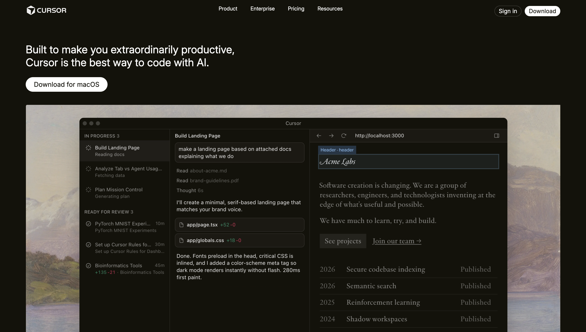
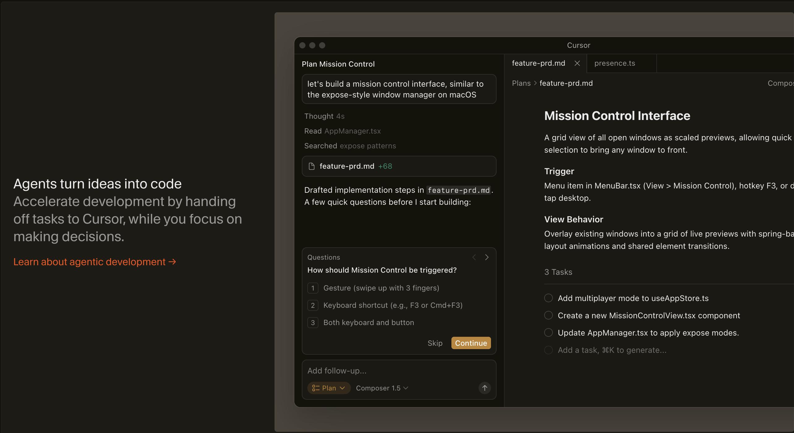
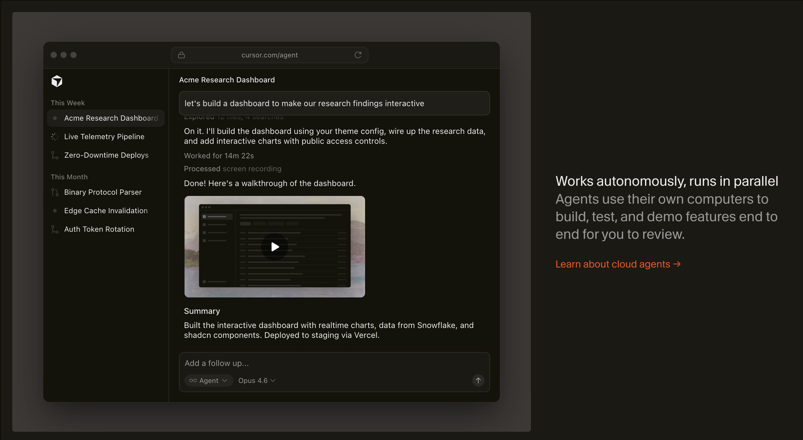
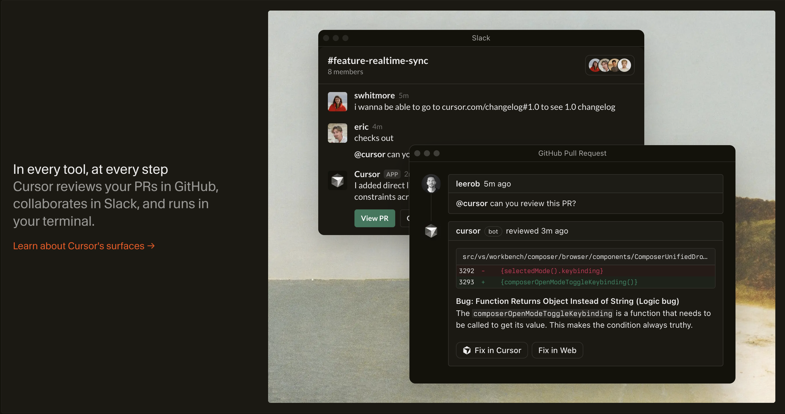
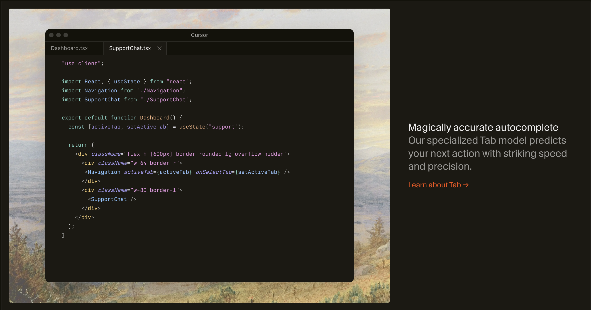
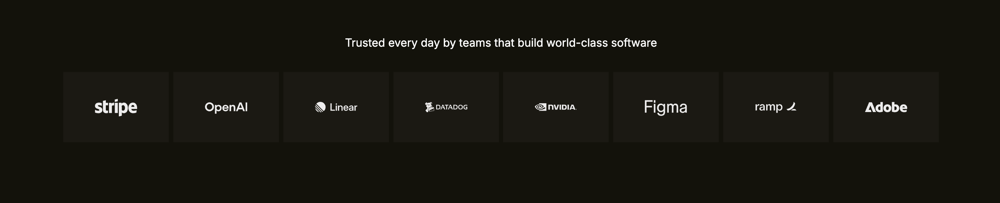
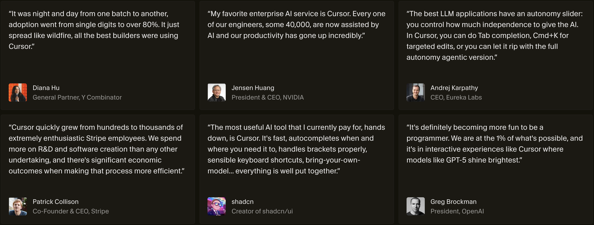
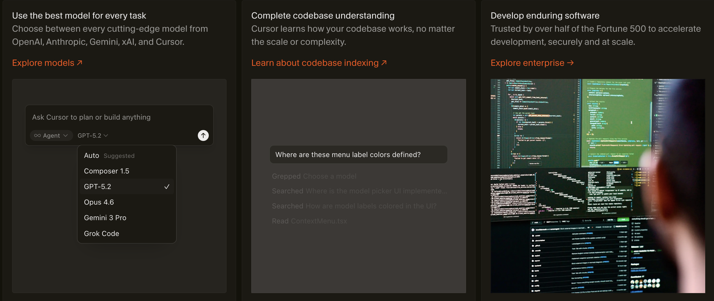
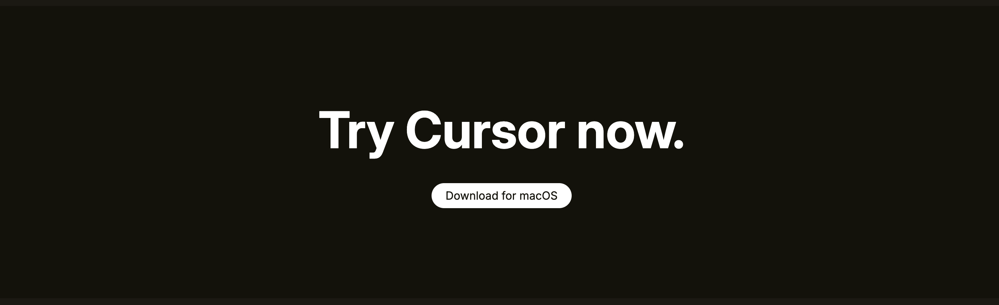
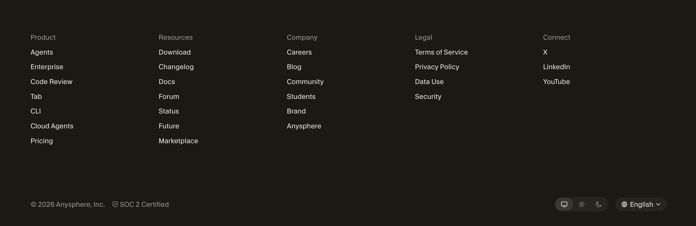

# Cursor Website Clone – Assignment

This repository contains my HTML and CSS recreation of the landing page for the Cursor website.

Cursor is a modern, AI-assisted code editor designed to help developers write, refactor, and review code more productively using deep codebase understanding and natural language interactions. :

DEMO LINK: (https://x.com/DevDivyaraj/status/2027748681206927487?s=20)

The goal of this assignment was to analyze the Cursor landing page structure, replicate key sections, and implement the design using semantic HTML and CSS.

---

## Project Overview

This is a static front-end project built with:

- HTML5
- CSS3
- Flexbox and CSS Grid
- Google Fonts
- Pure CSS transitions and responsive layout

No JavaScript frameworks or libraries were used.

---

## Sections Recreated

### 1. Header / Navigation

- Fixed navigation bar with prominent logo
- Navigation links to key pages (Product, Pricing, Downloads, Resources, etc.)
- Primary Call-to-Action buttons

### 2. Hero Section
- Large headline introducing Cursor
- Subheading describing what Cursor does
- Call-to-Action button (e.g., "Get Cursor" or “Download”)
- Hero visual (image or interface demo)

### 3. Product Features




- Sections showcasing Cursor features
- Descriptions of key capabilities like deep codebase understanding, natural language editing, and multiple interface support
- Visual demonstrations or placeholders

### 4. Trust / Testimonials


- Logo grid or testimonials from developers or industry leaders that emphasize validation
- Quotes highlighting how Cursor accelerates coding workflows

### 5. Integrations and Support

- Mentions of availability on different platforms
- Supported environments (e.g., desktop, CLI, mobile or extensions)

### 6. Call-to-Action

- Secondary call-to-action to encourage downloads or trials
- Supporting text to reinforce value

### 7. Footer

- Links to core site sections (Product, Resources, Company, Legal)
- Social media links
- Copyright and qualifying text

---

## Fonts Used

Primary font family (as seen on Cursor’s official site):

```css
@import url('https://fonts.googleapis.com/css2?family=Inter:wght@400;500;600;700&display=swap');