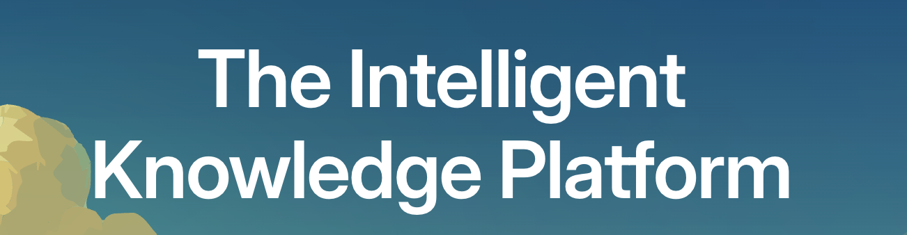
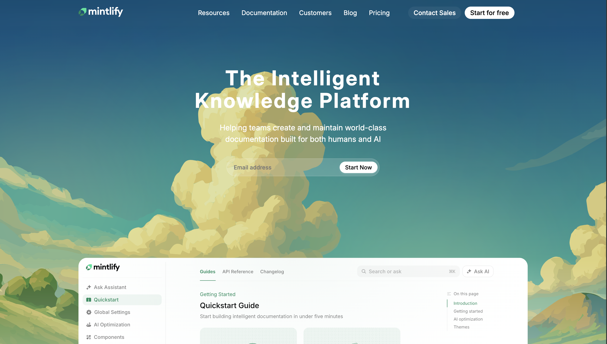
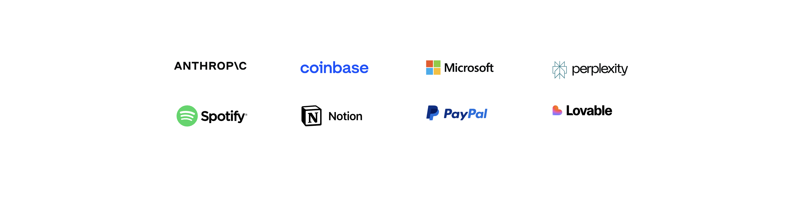
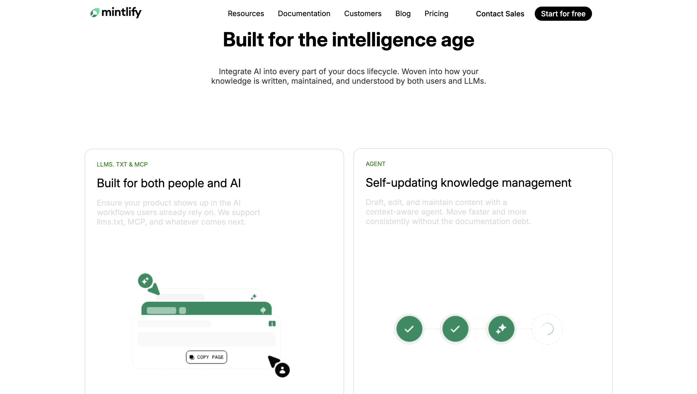
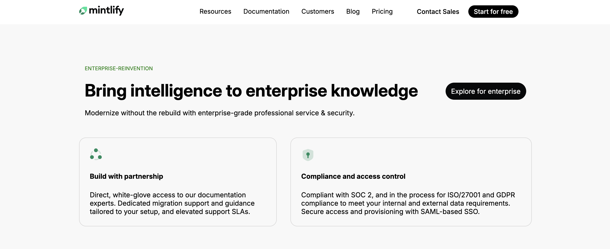
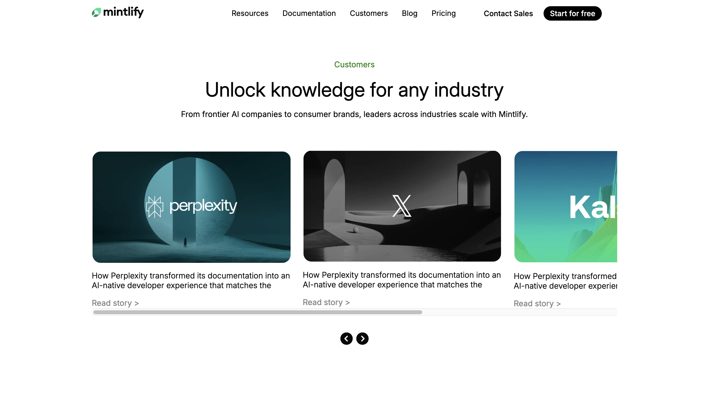
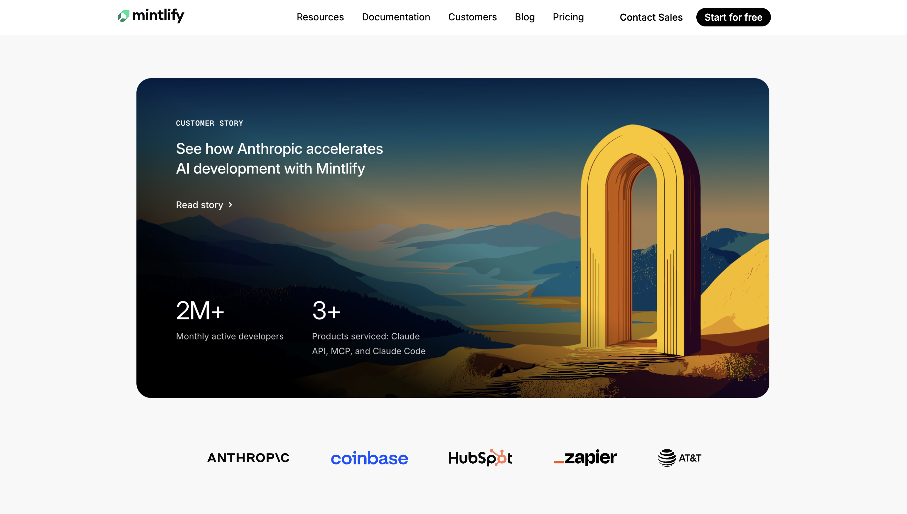
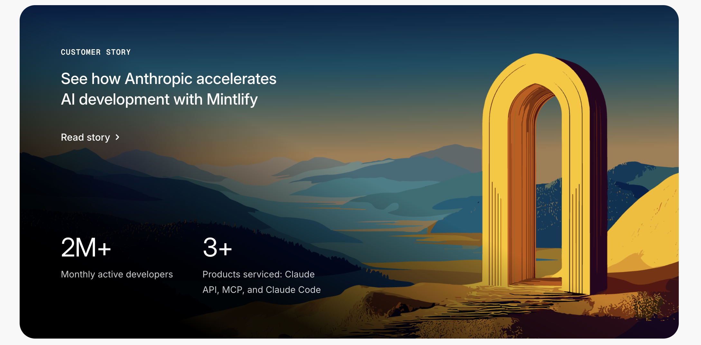
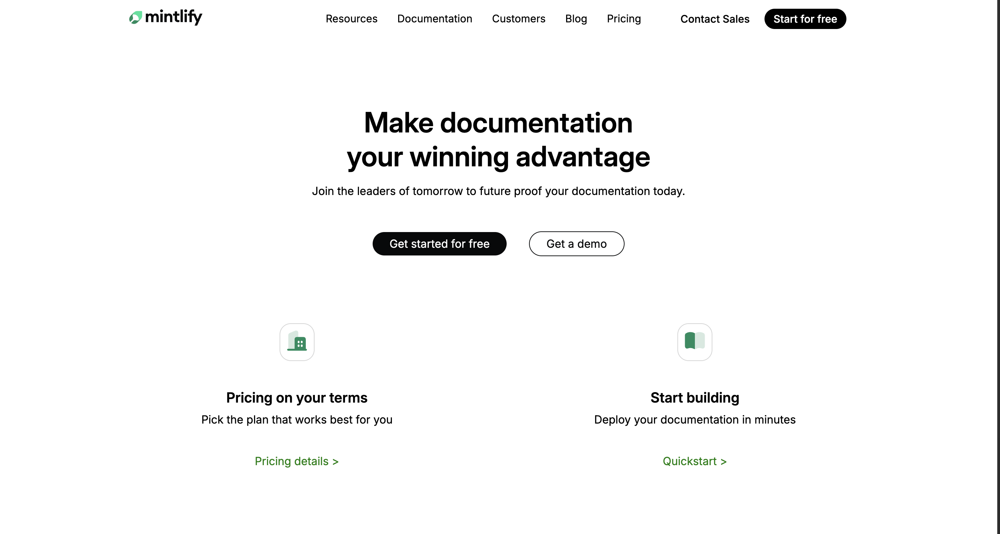
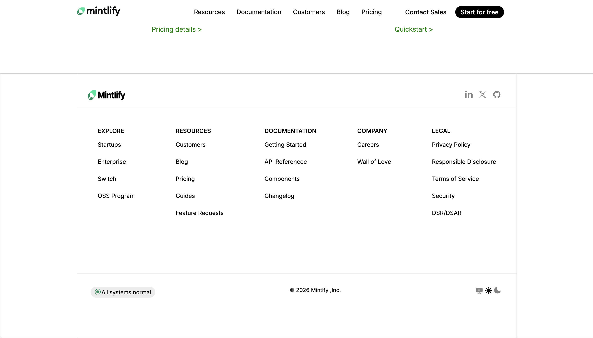

# Mintlify Landing Page Clone – Assignment

This project is a front-end recreation of selected sections from the official Mintlify website (https://www.mintlify.com/).

The objective of this assignment was to replicate the layout, typography, spacing, visual hierarchy, and UI behavior using HTML and CSS.

---
LINK: (https://www.linkedin.com/posts/divyarajsingh-dev_frontenddevelopment-webdesign-html-ugcPost-7433360467043086336-jzjz?utm_source=share&utm_medium=member_desktop&rcm=ACoAAEKsQrUBP-Lhhsq84Uz6nrtNZwQWjgJJRkE)
## Project Overview

This is a static landing page clone built using:

- HTML5
- CSS3
- Google Fonts (Inter)
- Pure CSS animations

No frameworks or JavaScript libraries were used.

---

## Sections Recreated

### 1. Header / Navigation Bar
## Project Demo


- Fixed transparent header
- Scroll-based morph animation
- Logo swap animation on scroll
- Navigation links (Resources, Documentation, Customers, Blog, Pricing)
- CTA buttons (Contact Sales, Start for free)

### 2. Hero Section

- Light SVG background
- Main heading:
  "The Intelligent Knowledge Platform"
- Supporting paragraph text
- Email input form with rounded button
- Hero illustration image
- Center-aligned layout

### 3. Partners Section

- Grid-based logo layout
- Brand logos aligned in a structured grid
- Responsive spacing

### 4. Features Section


- Section heading: "Built for the intelligence age"
- Three feature blocks:
  - Built for both people and AI
  - Self-updating knowledge management
  - Intelligent assistance for users
- Bordered feature cards
- Balanced typography and spacing

### 5. Enterprise Section


- Enterprise introduction block
- Enterprise CTA button
- Two enterprise feature highlights
- Customer story image
- Enterprise customer logos row

### 6. Customer Section


- Section heading and description
- Horizontally scrollable customer cards
- Read story buttons
- Slider navigation icons

### 7. Call-To-Action Section

- Headline:
  "Make documentation your winning advantage"
- Two CTA buttons:
  - Get started for free
  - Get a demo
- Supporting feature cards

### 8. Footer

- Logo and social icons
- Multi-column navigation links:
  - Explore
  - Resources
  - Documentation
  - Company
  - Legal
- Status indicator button
- Copyright text

---

## Fonts Used

Primary Font:
- Inter (Imported from Google Fonts)

Font Weights Used:
- 400 (Regular)
- 500 (Medium)
- 600 (Semi-Bold)

Font Import:

```css
@import url('https://fonts.googleapis.com/css2?family=Inter:ital,opsz,wght@0,14..32,100..900;1,14..32,100..900&display=swap');