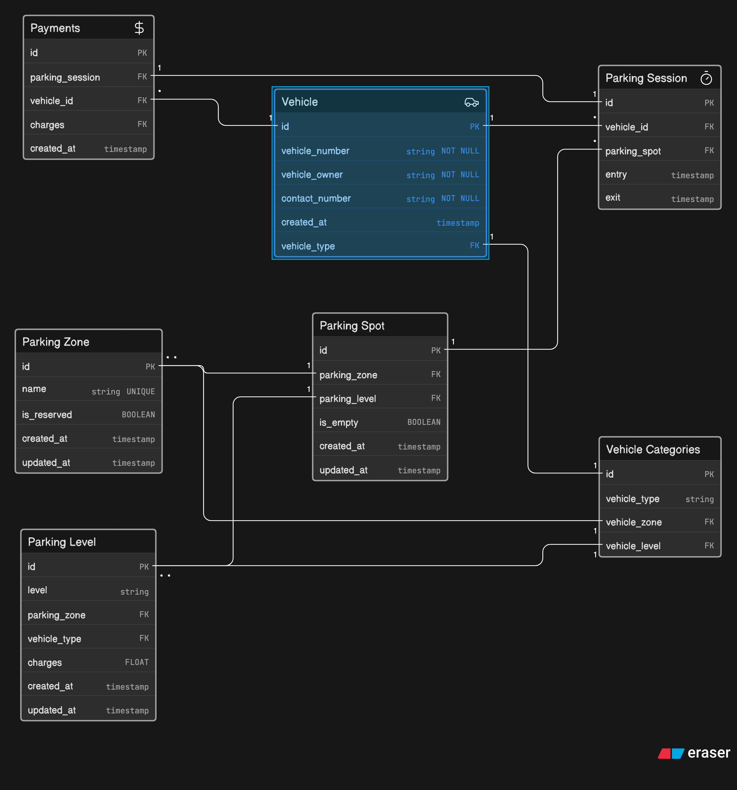

# ER Diagram — Multi-Zone Event Parking System

This ERD models a **large event parking system** for a convention venue such as Comic-Con India. The design supports **multiple vehicle visits**, **spot reuse over time**, **reserved parking**, **parking sessions**, **parking tickets**, and **payments**.

The model is designed to clearly answer:
- which vehicle entered
- what type of vehicle it was
- which spot was assigned
- which zone and level the spot belongs to
- whether the spot is reserved
- when the vehicle entered and exited
- what ticket was issued
- how much was charged
- whether payment was recorded
- which vehicles are currently parked

---

## Design Principles

1. **Separate static data from transactional data**  
   Vehicle categories, parking zones, parking levels, and reserved access categories are stored separately from parking sessions and payments.

2. **Support repeated visits**  
   A single vehicle can have many parking sessions over multiple days.

3. **Support spot reuse**  
   A single parking spot can be used by many vehicles over time through different parking sessions.

4. **Track availability properly**  
   Spot availability is represented through parking sessions and current occupancy status.

5. **Model reserved access realistically**  
   Parking categories such as VIP, staff, exhibitors, cosplayers with props, and EV charging are represented through vehicle categories and parking level rules.

6. **Keep the ERD readable and normalized**  
   Data is split into logical entities instead of being stored in one large table.

---

## Entities Included

- **Vehicle** — stores vehicle identity and ownership details
- **Vehicle Categories** — classifies vehicles and links them to allowed zones and levels
- **Parking Zone** — top-level parking area grouping
- **Parking Level** — level inside a zone with vehicle-type-based pricing and access rules
- **Parking Spot** — actual assignable parking space
- **Parking Session** — entry/exit record for each visit
- **Parking Ticket** — ticket issued when a vehicle enters
- **Payments** — payment record for a parking session

---

---
## Relationship Explanation

### 1. Vehicle → Vehicle Categories
Each vehicle belongs to a vehicle category. This allows the system to differentiate between:
- bikes
- cars
- SUVs
- cabs
- EVs

This is important because different vehicle categories may use different parking areas, levels, or reserved access rules.

### 2. Vehicle Categories → Parking Zone / Parking Level
A vehicle category can be mapped to the zones and levels where it is allowed to park. This supports access control for:
- VIP guests
- exhibitors
- creators
- staff
- EV charging vehicles
- cosplayers with props

### 3. Parking Zone → Parking Level → Parking Spot
Parking zones contain multiple levels, and each level contains multiple parking spots. This matches real venue layouts and makes spot allocation scalable.

### 4. Vehicle → Parking Session
A vehicle can have many parking sessions. This is essential because one vehicle may enter the venue multiple times across different days.

### 5. Parking Session → Parking Spot
Each parking session is assigned one parking spot. The same parking spot can be reused later in another session once it becomes free.

### 6. Parking Session → Parking Ticket
A ticket is issued for each session at the time of entry. This separates the **ticket** from the **session**, which is useful for auditing and real-world operations.

### 7. Parking Session → Payments
Each session can have a payment record. This allows the system to track charges, payment status, and whether a session is still unpaid.

---

## Example Use Cases Supported by the ERD

- Find all vehicles currently inside the venue
- See which spot a vehicle is occupying
- Check whether a spot is reserved for staff, VIP, or EV charging
- View vehicle entry and exit history
- Track unpaid parking sessions
- Reuse parking spots across multiple event days
- Determine parking availability by zone and level

---

