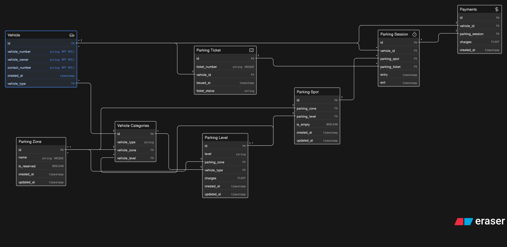

# ER Diagram — Multi-Zone Event Parking System

This ERD models a **large event parking system** for a convention venue such as Comic-Con India. The design supports **multiple vehicle visits**, **spot reuse over time**, **reserved parking**, **parking sessions**, **parking tickets**, and **payments**.

The model is designed to clearly answer:
- which vehicle entered
- what type of vehicle it was
- which spot was assigned
- which zone and level the spot belongs to
- whether the spot is reserved
- when the vehicle entered and exited
- what ticket was issued
- how much was charged
- whether payment was recorded
- which vehicles are currently parked

---

## Design Principles

1. **Separate static data from transactional data**  
   Vehicle categories, parking zones, parking levels, and reserved access categories are stored separately from parking sessions and payments.

2. **Support repeated visits**  
   A single vehicle can have many parking sessions over multiple days.

3. **Support spot reuse**  
   A single parking spot can be used by many vehicles over time through different parking sessions.

4. **Track availability properly**  
   Spot availability is represented through parking sessions and current occupancy status.

5. **Model reserved access realistically**  
   Parking categories such as VIP, staff, exhibitors, cosplayers with props, and EV charging are represented through vehicle categories and parking level rules.

6. **Keep the ERD readable and normalized**  
   Data is split into logical entities instead of being stored in one large table.

---

## Entities Included

- **Vehicle** — stores vehicle identity and ownership details
- **Vehicle Categories** — classifies vehicles and links them to allowed zones and levels
- **Parking Zone** — top-level parking area grouping
- **Parking Level** — level inside a zone with vehicle-type-based pricing and access rules
- **Parking Spot** — actual assignable parking space
- **Parking Session** — entry/exit record for each visit
- **Parking Ticket** — ticket issued when a vehicle enters
- **Payments** — payment record for a parking session

---

---
## Relationship Explanation

### 1. Vehicle → Vehicle Categories
Each vehicle belongs to a vehicle category. This allows the system to differentiate between:
- bikes
- cars
- SUVs
- cabs
- EVs

This is important because different vehicle categories may use different parking areas, levels, or reserved access rules.

### 2. Vehicle Categories → Parking Zone / Parking Level
A vehicle category can be mapped to the zones and levels where it is allowed to park. This supports access control for:
- VIP guests
- exhibitors
- creators
- staff
- EV charging vehicles
- cosplayers with props

### 3. Parking Zone → Parking Level → Parking Spot
Parking zones contain multiple levels, and each level contains multiple parking spots. This matches real venue layouts and makes spot allocation scalable.

### 4. Vehicle → Parking Session
A vehicle can have many parking sessions. This is essential because one vehicle may enter the venue multiple times across different days.

### 5. Parking Session → Parking Spot
Each parking session is assigned one parking spot. The same parking spot can be reused later in another session once it becomes free.

### 6. Parking Session → Parking Ticket
A ticket is issued for each session at the time of entry. This separates the **ticket** from the **session**, which is useful for auditing and real-world operations.

### 7. Parking Session → Payments
Each session can have a payment record. This allows the system to track charges, payment status, and whether a session is still unpaid.

---

## Example Use Cases Supported by the ERD

- Find all vehicles currently inside the venue
- See which spot a vehicle is occupying
- Check whether a spot is reserved for staff, VIP, or EV charging
- View vehicle entry and exit history
- Track unpaid parking sessions
- Reuse parking spots across multiple event days
- Determine parking availability by zone and level

---

# ERD Question Answers — Multi-Zone Event Parking System

This document explains how the ER Diagram answers the required parking system questions and satisfies the evaluation criteria.

---

# ERD Question Answers

## 1. What vehicles entered the parking facility?

The system tracks this using:

* `Vehicle`
* `Parking Session`

### Relationship

```eraser
Vehicle.id < Parking Session.vehicle_id
```

Each time a vehicle enters, a new parking session is created.

This allows the system to track:

* which vehicle entered
* how many times it entered
* when it entered
* entry history across multiple event days

---

## 2. What type of vehicle entered?

Vehicle type is stored using:

* `Vehicle.vehicle_type`
* linked with `Vehicle Categories.id`

### Relationship

```eraser
Vehicle.vehicle_type > Vehicle Categories.id
```

This supports different categories such as:

* Bike
* Car
* SUV
* Cab
* EV Vehicle

---

## 3. Which parking spot was assigned?

The assigned parking spot is stored in:

* `Parking Session.parking_spot`

### Relationship

```eraser
Parking Spot.id < Parking Session.parking_spot
```

Each parking session gets one assigned parking spot.

---

## 4. Which zone or level does that parking spot belong to?

Parking spots are connected to:

* `Parking Zone`
* `Parking Level`

### Relationships

```eraser
Parking Zone.id > Parking Spot.parking_zone
Parking Level.id > Parking Spot.parking_level
```

This helps identify:

* parking area
* parking floor
* parking section

---

## 5. Was the parking spot reserved for exhibitors, VIP guests, staff, or EV charging?

Yes.

Reserved parking is modeled using:

* `Parking Zone.is_reserved`
* `Vehicle Categories`
* `Parking Level.vehicle_type`

This supports reserved access for:

* VIP guests
* Staff members
* Exhibitors
* EV charging vehicles
* Cosplayers with props

---

## 6. When did the vehicle enter the facility?

Stored in:

```eraser
Parking Session.entry
```

This stores the vehicle entry timestamp.

---

## 7. When did the vehicle exit the facility?

Stored in:

```eraser
Parking Session.exit
```

This stores the vehicle exit timestamp.

If the value is `NULL`, the vehicle is still parked inside.

---

## 8. What ticket was issued for the parking session?

The current ERD partially supports parking tracking through `Parking Session`.


This supports:

* ticket generation
* ticket verification
* ticket reprinting
* audit tracking

---

## 9. Can one vehicle visit the venue multiple times across different days?

Yes.

### Relationship

```eraser
Vehicle.id < Parking Session.vehicle_id
```

This is a:

* One-to-Many relationship

Meaning:

* one vehicle
* many parking sessions

This supports repeated event visits.

---

## 10. Can one parking spot be reused across multiple parking sessions?

Yes.

### Relationship

```eraser
Parking Spot.id < Parking Session.parking_spot
```

A parking spot can:

* become free after exit
* be assigned again later
* serve different vehicles over time

---

## 11. How is parking availability tracked?

Availability is tracked using:

```eraser
Parking Spot.is_empty
```

### Logic

* `TRUE` → spot available
* `FALSE` → spot occupied

The system can also identify occupied spots using active sessions where:

```eraser
Parking Session.exit IS NULL
```

---

## 12. How are parking charges calculated?

Parking charges are stored in:

```eraser
Parking Level.charges
```

Charges may depend on:

* vehicle type
* parking level
* reserved area
* premium/VIP access

Typical calculation:

```text
(Exit Time - Entry Time) × Charges
```

---

## 13. How is payment recorded for each parking session?

Payment tracking uses:

* `Payments`

### Relationships

```eraser
Payments.vehicle_id > Vehicle.id
Payments.parking_session > Parking Session.id
```

This stores:

* payment details
* related parking session
* related vehicle
* charge amount

---

## 14. Can special access categories be represented?

Yes.

The ERD supports categories such as:

* VIP guests
* Exhibitors
* Staff
* EV charging vehicles
* Cosplayers with props

Using:

* `Vehicle Categories`
* reserved parking zones
* vehicle-type-based parking levels

---

## 15. Can the system track which vehicles are currently parked inside the venue?

Yes.

A vehicle is considered currently parked when:

```text
Parking Session.exit IS NULL
```

This supports:

* real-time occupancy tracking
* live parking monitoring
* active session management

---

# Evaluation Parameters Explanation

## 1. Parking System Understanding (15 Marks)

The ERD models:

* multi-zone parking
* parking levels
* reserved access
* vehicle categories
* parking sessions
* payments
* parking allocation

It is designed as a complete event parking system rather than a simple entry-exit tracker.

---

## 2. Entity Quality (20 Marks)

The ERD properly separates major entities:

| Entity             | Purpose                           |
| ------------------ | --------------------------------- |
| Vehicle            | Stores vehicle details            |
| Vehicle Categories | Defines vehicle/access categories |
| Parking Zone       | High-level parking areas          |
| Parking Level      | Levels inside parking zones       |
| Parking Spot       | Actual assignable parking space   |
| Parking Session    | Entry and exit tracking           |
| Payments           | Payment records                   |

Reserved parking categories are represented realistically.

---

## 3. Relationship Modeling (20 Marks)

The ERD correctly models:

### One Vehicle → Many Sessions

A single vehicle can visit multiple times.

### One Spot → Many Sessions

A parking spot can be reused across time.

### One Zone → Many Levels

Zones contain multiple levels.

### One Level → Many Spots

Levels contain multiple parking spots.

The relationships are normalized and practical.

---

## 4. Attribute and Table Design (15 Marks)

Important attributes are included:

| Attribute    | Purpose                 |
| ------------ | ----------------------- |
| entry        | Vehicle entry timestamp |
| exit         | Vehicle exit timestamp  |
| is_empty     | Spot availability       |
| charges      | Parking fee             |
| vehicle_type | Vehicle classification  |
| created_at   | Audit tracking          |

Information is distributed logically instead of being stored in one large table.

---

## 5. PK/FK and Junction Tables (15 Marks)

The ERD includes:

* primary keys for all major entities
* foreign keys for relationships
* normalized references between tables

Foreign keys correctly support:

* session allocation
* spot assignment
* vehicle categorization
* payment tracking
* zone and level mapping

---

## 6. Real-World Practicality (10 Marks)

The ERD supports:

* multi-day events
* reusable parking spots
* reserved parking
* EV charging areas
* live occupancy tracking
* repeated vehicle visits
* payment tracking

This makes the design practical for:

* Comic-Con events
* Expo centers
* Stadium events
* Large convention venues

---

## 7. Diagram Neatness (5 Marks)

The ERD is structured clearly:

* related entities are grouped together
* PK/FK relationships are readable
* relationship lines are understandable
* entity names and attributes are visible

This improves readability and evaluation quality.

---

# Conclusion

This ERD successfully models a scalable and realistic event parking management system.

The design supports:

* vehicle tracking
* spot allocation
* parking sessions
* reserved parking categories
* reusable parking spots
* payment records
* fee calculation
* real-time occupancy tracking

while maintaining:

* normalization
* clear relationships
* practical implementation
* readable structure.
