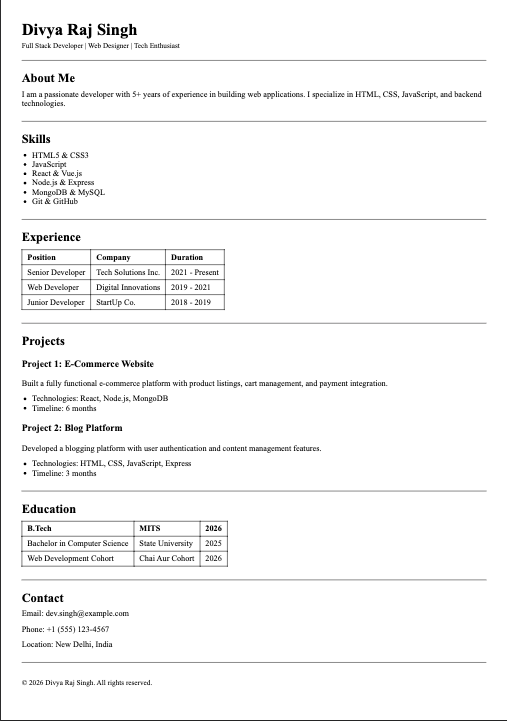

#HTMl Resume Assignment - 30 Jan 2026

    I am adding just mock data here. I have ensured to use semantics elements for each and everythings. You Will get Screenshot at last.

##Used Tags:
1. <h1> - Used just one, to denote my name. 
2. <h2> - Several to denote the heading of particular section
3. <header>, <main>, <footer> - to divide content as per it's meaning. Header on top, main to show main content, and footer at last
4. <table>, <theader>, <tbody>, <tr>,<td> and <td> - used to make relevent tables. These represent beginning of table, it's header, it's body, row, data and header respectively.
5. <a> - I have also used anocher tags to denote mail & telephone no. using special href attribute.

